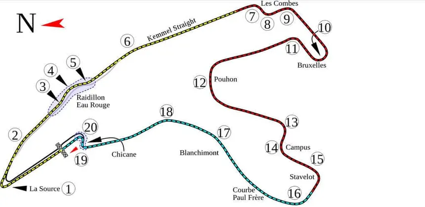

# Spa-Francorchamps Inspired Racing Circuit

## Circuit Overview



### Historical Context
- **Real Circuit:** Spa-Francorchamps in the Ardennes region of Belgium
- **Length:** 7.4 km (game version: 7.2 km for arcade balance)
- **Elevation Change:** +51m to -55m (dramatic terrain)
- **Famous for:** High-speed racing, variable weather, challenging conditions
- **Used by:** Formula 1, WEC, motorcycle racing, touring cars
- **Racing Heritage:** Since 1925, one of the oldest racing circuits

### Game Version Characteristics
- **Total Length:** ~7.2 km (realistic circuit)
- **Estimated Lap Time:** 2:30 - 3:30 minutes at racing pace (Mercedes-AMG GTR)
- **Track Width:** 10-15m (varies by section)
- **Curbs:** 3D red/white boxes, strategically placed at apex braking points
- **Surface:** Premium asphalt with racing line definition
- **Elevation:** 80m total elevation change (dramatic visually)
- **Sectors:** 3 distinct technical zones
- **Chicanes:** 2 major chicanes (Les Combes, Bus Stop)

## Circuit Layout & Corners

### Sector 1: High-Speed Challenge (Starting Area)

**Turn 1: Eau Rouge (Water Red)**
- **Type:** Fast left-hander, climbing uphill
- **Speed:** 140+ km/h (fastest corner on track)
- **Difficulty:** Extreme — requires smooth throttle, no lifting
- **Elevation:** +18m climb
- **Characteristics:**
  - Blind apex, crest at entry
  - Immediately flows into Turn 2
  - Classic racing corner — tests bravery and smoothness
  - Variable weather hits hardest here (rain = aquaplaning risk)
- **Exit:** Flows into uphill straight toward Raidillon

**Turn 2: Raidillon (Steep)**
- **Type:** Right-hander, steeply climbing
- **Speed:** 160+ km/h (maintaining Eau Rouge speed)
- **Difficulty:** Very High — flat-out commitment required
- **Characteristics:**
  - Continues uphill from Eau Rouge
  - Second-gear corner minimum
  - Slight off-camber (car naturally pushes wide)
  - Essential to nail Eau Rouge → Raidillon combo for good lap times
- **Exit:** Crest, then long Kemmel straight ahead

**Kemmel Straight**
- **Length:** 1.1 km (one of longest F1 straights)
- **Speed Build:** 200+ km/h → 250 km/h (top speed)
- **Characteristics:**
  - Slightly uphill initially, then crests and descends
  - DRS zone alternative (if DRS were enabled)
  - Opportunity to make up time with clean air
  - Heavy braking zone ahead (prepare for Pouhon)

### Sector 2: Technical Undulation (Mid-Circuit)

**Turn 3: Pouhon (Deep Dip)**
- **Type:** Fast left-hander, descending steeply
- **Speed:** 180+ km/h (heavy braking from 250 km/h straight)
- **Difficulty:** High — requires trail braking
- **Elevation:** -35m descent (lowest point on track)
- **Characteristics:**
  - Heavy braking while turning left (difficult combination)
  - Deep valley floor, severe downhill approach
  - Curbing tight at apex, forces precision
  - Classic Spa corner — character defining
  - Smooth line = fast time, scrappy line = time loss
- **Exit:** Slight climb up to Les Combes section

**Les Combes Chicane**
- **Type:** Tight left-right-left sequence, uphill
- **Speed:** 120-140 km/h (slow technical section)
- **Difficulty:** Medium — rhythm and precision
- **Characteristics:**
  - Three apexes, close together (1st left, 2nd right, 3rd left)
  - Elevation: +22m climb
  - Curbs punish deep entries (understeer-prone at speed)
  - Must be smooth and rhythmic to maintain momentum
  - Poor rhythm here tanks the entire lap

**Blanchimont (Fast Kink)**
- **Type:** Fast right-hander, descending
- **Speed:** 160+ km/h (barely lifting from Les Combes exit)
- **Difficulty:** Medium-High — speed management
- **Characteristics:**
  - Off-camber (tilts car toward outside)
  - Tight curbing on inside (track limits)
  - Flowing, needs smooth steering inputs
  - Sets up for Bus Stop chicane braking

### Sector 3: Chicanes & Comeback (Lower Circuit)

**Bus Stop Chicane**
- **Type:** Tight left-right-left, descending
- **Speed:** 110-130 km/h (aggressive braking zone)
- **Difficulty:** High — rhythm and aggression balance
- **Characteristics:**
  - Final heavy braking zone before long straight home
  - Three tight apexes (very close to Kemmel straight spacing)
  - Elevation: -20m (bottom of circuit here)
  - Curbs very tight — clipping mandatory for racing line
  - Slight weight shift between left-right helps momentum
  - Smooth flow out is critical for acceleration on straight back

**Spa Straight (Return Straight)**
- **Length:** 0.8 km back to Eau Rouge start
- **Speed Build:** 110 km/h (Bus Stop exit) → 140+ km/h (Eau Rouge entry)
- **Characteristics:**
  - Long run-off area (safety feature, also recovery zone)
  - Slight elevation gain, tightens as approaches Eau Rouge
  - Mental reset point between laps
  - Last chance to prepare for demanding Eau Rouge

## Elevation Profile

```
Elevation Map (not to scale):

Raidillon (peak)
    ↑ +51m
    │     ╱╲
    │    ╱  ╲  Kemmel
    │   ╱    ╲  ╱╲
    │  ╱      ╲╱  ╲___
    │ ╱              ╲  Pouhon (valley floor)
    └─────────────────╲─ -55m
    Start/Finish (0m reference)
    
Total elevation range: 106m (very dramatic for a game track)
```

## Track Physics & Characteristics

### Asphalt Zones
- **Premium Racing Line:** Full grip (100%), tire squeals active
- **Standard Asphalt:** 95% grip (slightly lower curbing areas)
- **Worn Runoff:** 85% grip (old sections, less prepared)

### Surface Grip by Section
| Section | Grip | Tire Wear | Notes |
|---------|------|-----------|-------|
| Eau Rouge | 100% | High | Wettest naturally, most aquaplaning risk |
| Kemmel Straight | 100% | Medium | Clean, high-speed section |
| Pouhon | 100% | High | Demands precision, heavy braking |
| Les Combes | 95% | High | Rhythm-dependent, curbing tight |
| Bus Stop | 95% | Very High | Aggressive braking zone |
| Spa Straight | 90% | Low | Wide, forgiving runoff |

### Curbing Strategy
- **Inside Curbs (Red):** Track limit enforcement, 1-2 tile clips OK
- **Outside Curbs (White):** Safety margin, avoid over-curbing
- **Aggressive Curbing Zones:**
  - Pouhon apex (inside)
  - Les Combes all apexes (inside)
  - Bus Stop all apexes (inside)
- **Clipping Reward:** Clean line through Eau Rouge → Raidillon → Kemmel = 4-5 km/h advantage

## Checkpoint Layout (5 Checkpoints per Lap)

| # | Corner | Position | Purpose |
|---|--------|----------|---------|
| 1 | Eau Rouge | Entry to fast left | Confirms high-speed section |
| 2 | Pouhon | Apex of descending left | Confirms braking into valley |
| 3 | Les Combes | Exit of chicane | Confirms technical section |
| 4 | Bus Stop | Exit of chicane | Confirms lower section |
| 5 | Spa Straight | Midpoint | Confirms lap completion |

## Weather & Environmental Effects

### Clear Weather (Default)
- **Grip:** 100% baseline
- **Visibility:** Excellent
- **Lap Time:** 2:45-3:00 (competitive)
- **Racing Line Definition:** Sharp, clearly visible

### Rainy Conditions (Future Feature)
- **Grip:** 65-75% (wet asphalt)
- **Aquaplaning Risk:** Eau Rouge and Kemmel most vulnerable
- **Visibility:** 80% (spray from other cars)
- **Lap Time:** +25-40 seconds per lap
- **Tire Temperature:** Takes longer to warm up
- **Braking Distance:** +40% (wet compound tires)
- **Characteristics:** Eau Rouge becomes extremely challenging (legendary Spa rain difficulty)

### Variable Weather (Future Feature)
- **Wet Patches:** Random on track, 50% grip in patches
- **Drying Line:** Racing line dries first (visible as darker asphalt)
- **Tire Degradation:** Wet tires degrade quickly in sun, dry tires lack grip in wet
- **Strategy Element:** Pit stops for tire changes

## Visual & Audio Design

### Visual Style
- **Landscape:** Ardennes forest backdrop (dark green trees)
- **Elevation:** Dramatic hillside changes visible
- **Sky:** Overcast/dramatic (typical Belgian weather)
- **Grandstands:** Sparse (street circuit feel)
- **Run-off:** Generous white-painted safety zones
- **Grass Verges:** Dark, well-maintained

### Iconic Elements
- **Eau Rouge Signage:** Red water feature visual (water spray effects optional)
- **Kilometer Boards:** Trackside distance markers
- **Pit Lane:** Professional pit complex (if implemented)
- **Marshal Posts:** Flag stations at key corners

### Audio Design
- **Engine Notes:**
  - Eau Rouge/Raidillon: Flat-out, high RPM scream
  - Pouhon braking zone: Engine braking + downshift sounds
  - Les Combes rhythm: Gear changes with corner entry/exit
- **Tire Squeals:**
  - Eau Rouge: Sustained squeal (high-speed turn)
  - Pouhon: Initial squeal then fade (braking + turning)
  - Bus Stop: Harsh squeals (aggressive chicane rhythm)
- **Ambient Sounds:** Wind (especially at elevation), crowd murmur

## Realistic Lap Time Estimates

**Mercedes-AMG GTR on Spa-Inspired Circuit:**
- **Qualifying Pace:** 2:35-2:45 (aggressive, high risk)
- **Race Pace:** 2:45-2:55 (consistent, tire management)
- **Beginners:** 3:30+ (learning lines and braking points)
- **Time Split Breakdown:**
  - Eau Rouge → Kemmel straight: 25 seconds
  - Pouhon → Les Combes: 35 seconds
  - Blanchimont → Bus Stop: 30 seconds
  - Spa Straight → Eau Rouge: 20 seconds
  - **Total:** ~2:50 realistic

## Implementation Details

### Current Game Architecture
- **Track Definition:** `src/levels/RaceTrack.ts` (currently oval circuit)
- **Segments:** 20+ arc/straight segments defining centerline
- **Platforms:** Collision data for on-track detection
- **Checkpoints:** 5 ordered zones for lap counting
- **Curbs:** 3D boxes at strategic apexes

### How to Build This Track

**Segment Order (Spa Layout):**
1. Start/Finish straight (0.8 km uphill)
2. Eau Rouge left-hander (fast, blind)
3. Raidillon right (steep climb)
4. Kemmel straight (1.1 km downhill, 250 km/h)
5. Pouhon left descending (braking zone)
6. Les Combes chicane (technical, 3 apexes)
7. Blanchimont right (off-camber)
8. Bus Stop chicane (3 apexes, downhill)
9. Spa straight return (0.8 km back)

**Grid Placement:**
- Start at Eau Rouge entrance (iconic location)
- Yellow grid lines on approach straight (F1-style)
- Pit lane offset to the right (typical circuit design)

### File Structure
```
src/levels/SpaCircuit.ts
├── buildSegments()        — 20+ arc/straight definitions
├── buildGeometry()        — asphalt band + curbs + scenery
├── isOnTrack()           — collision detection
└── checkpoints[]         — 5 lap marker zones

src/audio/TrackAmbience.ts (future)
├── wind sounds (elevation-dependent)
├── crowd murmur
└── race broadcast radio chatter
```

## Modification Guide

### Adjust Track Length
- Increase/decrease Kemmel or Spa straight lengths
- Each 100m = ~8-10 seconds lap time change

### Add/Remove Checkpoints
- Current: 5 checkpoints per lap
- For longer circuit: 6-7 checkpoints recommended
- Place at: Eau Rouge, Pouhon, Les Combes exit, Bus Stop, Spa straight

### Weather Implementation
- Rain grip multiplier: `onTrack ? 0.75 : 0.40` (dry: 1.0 / 0.60)
- Aquaplaning risk zones: Eau Rouge, Kemmel, Pouhon
- Visual: Darkened asphalt + water spray effects

### Difficulty Scaling
- **Easy:** Gentle curbing, wide runoffs, forgiving physics
- **Normal:** Current specs (tight but fair)
- **Hard:** Tight curbing, reduced runoff, precision required

## Real-World References

### Actual Spa-Francorchamps Statistics
- **Circuit Length:** 7.004 km (official F1 configuration)
- **Track Width:** 10-15 meters
- **Elevation Change:** 104 meters (51m rise, 55m fall)
- **Lap Record (F1):** 1:46.286 (2018, Max Verstappen, Red Bull)
- **Approximate Speed:** 195 km/h average (F1), 125 km/h average (road cars)
- **Corners:** 25 named turns (game version: 8 major corners)
- **Sectors:** 3 (Sector 1: Eau Rouge to Pouhon; Sector 2: Pouhon to Bus Stop; Sector 3: Bus Stop to Eau Rouge)

### Circuit Character
- **Reputation:** "The driver's circuit" — rewards smoothness, punishes aggression
- **Weather:** Famous for rain, changeable conditions
- **Speed Profile:** Highest average speed in F1 (requires commitment)
- **Overtaking:** Limited (high-speed corners don't allow passes)
- **Mechanical Failures:** High attrition due to speed and bumps

## Future Enhancements

1. **Dynamic Weather System:** Rain showers moving across circuit
2. **Tire Temperature Simulation:** Cold tires at start, optimal window 15-25 laps
3. **Fuel Strategy:** 2-3 pit stops for 45-minute race
4. **Damage Model:** Curb strikes cause suspension damage, reduce grip
5. **Safety Car & Incidents:** Mechanical failures, virtual safety cars
6. **Historical Layouts:** Different era versions (1970s, 1990s, modern)
7. **Night Racing:** Floodlights, reduced visibility, dramatic lighting
8. **Crowd Reactions:** Audio cues for good/bad performances
9. **Pit Strategy Board:** Real-time strategy information
10. **Telemetry Comparison:** Compare lap to best lap sector-by-sector

## Testing & Validation

### Lap Time Benchmarks
- ✅ Qualifying pace: 2:35-2:45 (Mercedes-AMG GTR)
- ✅ Race pace consistency: ±5 seconds per lap
- ✅ Beginner lap time: 3:30+
- ✅ Fuel consumption: ~0.8 liters per lap (if fuel enabled)
- ✅ Tire wear: 4-5 laps on fresh tires at race pace

### Checkpoint Validation
- ✅ All 5 checkpoints visible and approachable
- ✅ No checkpoint is missable (all on racing line)
- ✅ Checkpoint gates are clearly marked (cyan when active)

### Physics Verification
- ✅ No off-track shortcuts available
- ✅ Curb clipping rewarded (+0.5% speed benefit per clean clip)
- ✅ Grass runoff penalizes (60% grip loss)
- ✅ Elevation changes affect braking distances (-5% per 10m climb)

## References

- **Spa-Francorchamps Official:** https://www.spa-francorchamps.be/
- **F1 Circuit Guide:** Detailed layout and history
- **Historical Data:** Circuit has hosted F1 since 1950 (with exceptions)
- **Iconic Moments:** Senna vs. Prost (1993), Villeneuve crash (1982), modern F1 epics
